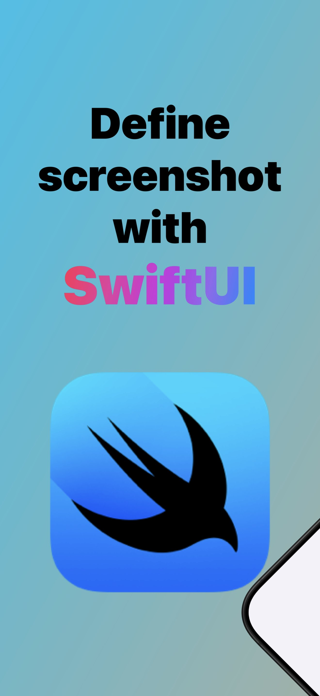
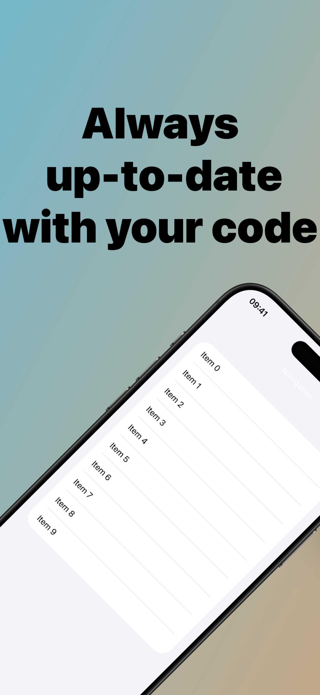
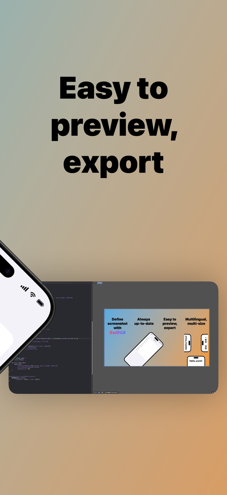
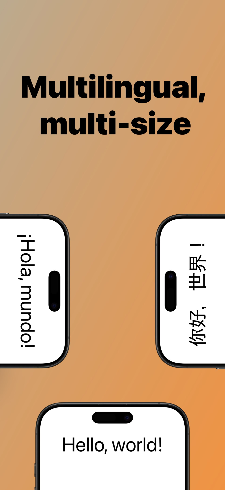
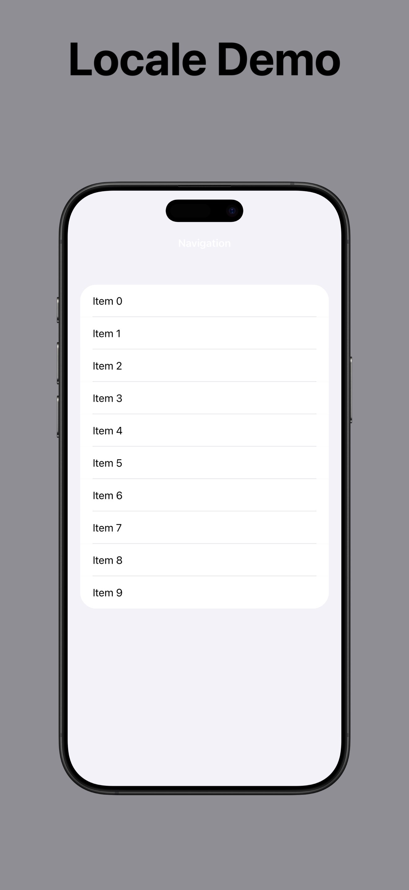
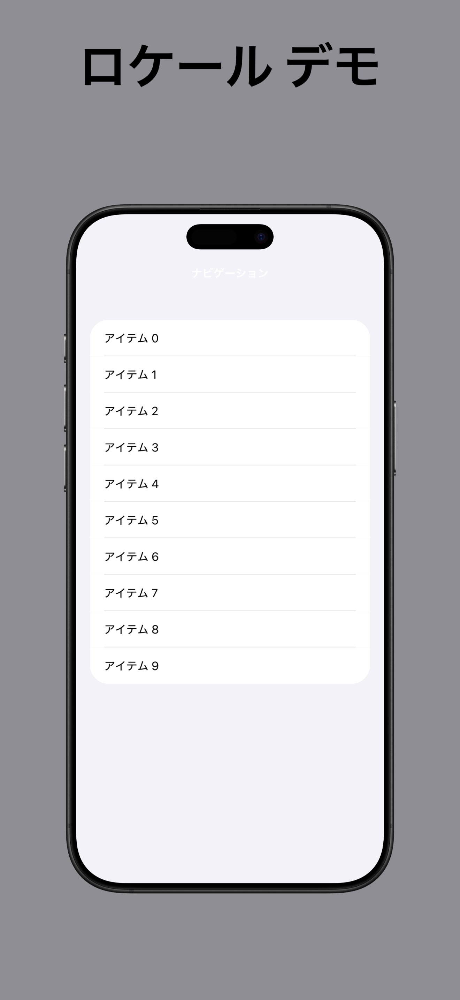
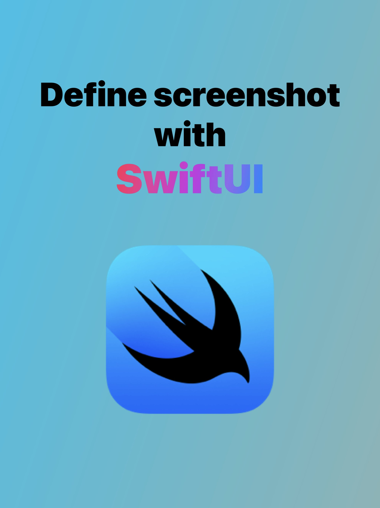
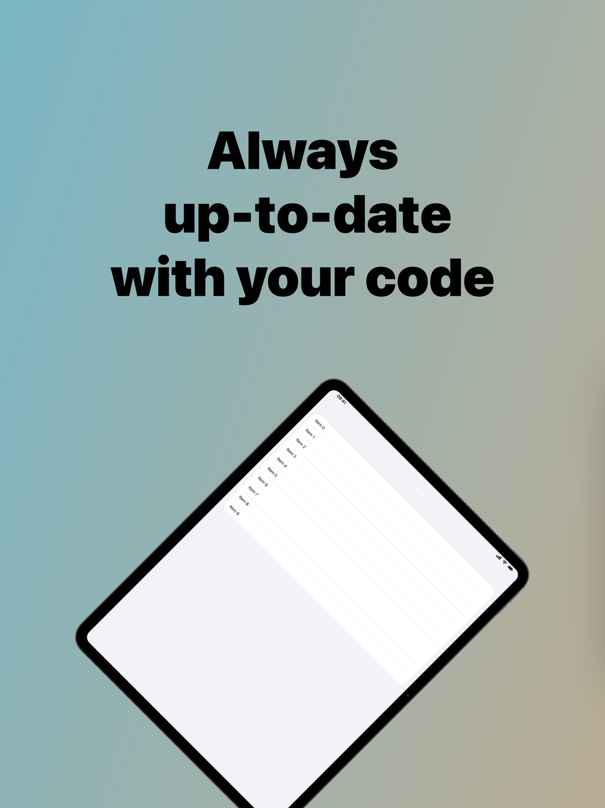
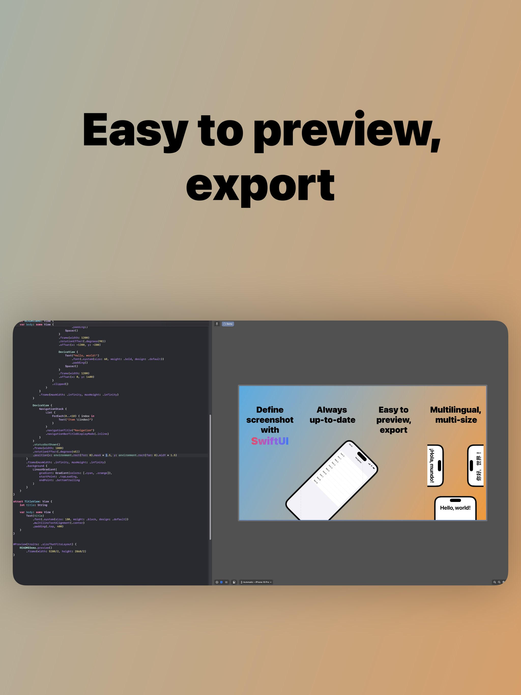
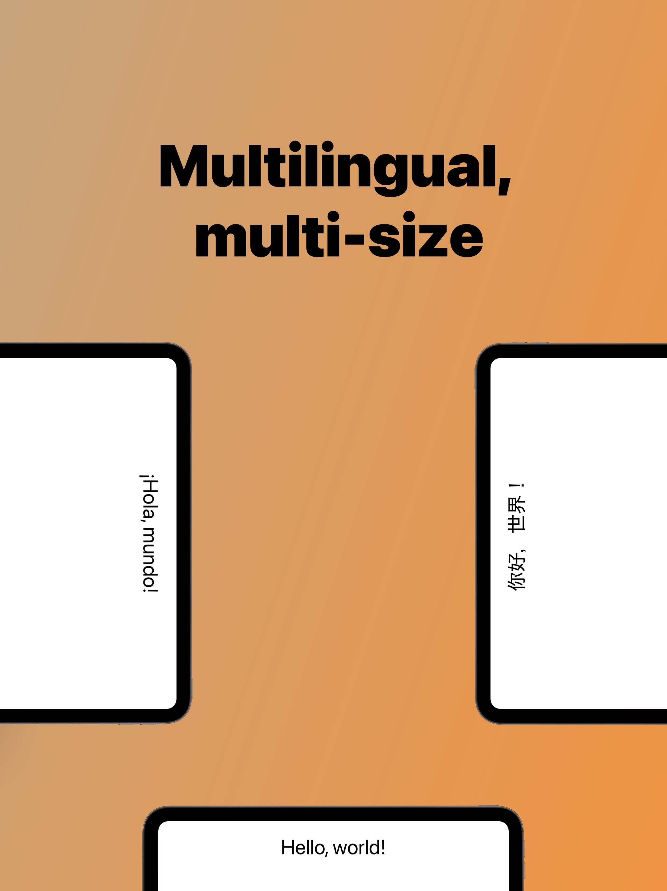

# AppScreenshotKit

Generate App Store screenshots from SwiftUI views. Optionally render them inside Apple device frames.
Wrap your production views in `DeviceView` so screenshots stay in sync with your current UI.

> To use Apple device frames, download the bezel assets once (see [CLI](#cli)).

<details open>
<summary><b>Screenshots</b></summary>
<div align="center">
  <p>
    
    
    
    
  </p>
</div>
</details>

## Quickstart

1. Add the package and products.

```swift
.package(url: "https://github.com/shitamori1272/AppScreenshotKit.git", from: "0.2.0"),
```

```swift
// In your target
.target(
    name: "MyApp",
    dependencies: [
        .product(name: "AppScreenshotKit", package: "AppScreenshotKit")
    ]
)

// In your test target
.testTarget(
    name: "MyAppTests",
    dependencies: [
        .product(name: "AppScreenshotKitTestTools", package: "AppScreenshotKit")
    ]
)
```

2. (Optional) Download Apple device frames.

```bash
swift run AppScreenshotKitCLI download-bezel-image
```

3. Define a screenshot view (Demo example).

```swift
import AppScreenshotKit
import SwiftUI

@AppScreenshot(
    .iPhone69Inch(),
    options: .locale([Locale(identifier: "ja_JP"), Locale(identifier: "en_US")])
)
struct LocaleDemo: View {
    @Environment(\.appScreenshotEnvironment) var environment

    var body: some View {
        VStack {
            Text("Locale Demo")
                .font(.system(size: 150, weight: .bold))

            DeviceView {
                DemoAppView() // Replace with your app view
            }
            .frame(height: environment.screenshotSize.height * 0.7)
        }
        .frame(maxWidth: .infinity, maxHeight: .infinity)
    }
}
```

<details>
<summary><b>Output</b></summary>
<div align="center">
  
  
</div>
</details>

4. Preview in Xcode.

```swift
#Preview {
    LocaleDemo.preview()
}
```

5. Export in tests (Swift Testing).

```swift
import AppScreenshotKitTestTools
import Foundation
import Testing

@Test @MainActor
func exportScreenshots() throws {
    let output = URL(fileURLWithPath: "/path/to/Screenshots")
    let exporter = AppScreenshotExporter(option: .file(outputURL: output))
    try exporter.export(LocaleDemo.self)
}
```

Run the test target on an iOS simulator.

## Customization

<details>
<summary><b>Devices, locales, tiles</b></summary>

- Add multiple devices or orientations.
- Generate per-locale screenshots.
- Create multi-tile walkthroughs.
- Export to files or attach to XCTest results.

Demo example (full source in `Demo/Sources/Demo/Demo.swift`):

```swift
@AppScreenshot(.iPhone69Inch(), .iPad130Inch(), options: .tiles(4))
struct READMEDemo: View {
    @Environment(\.appScreenshotEnvironment) var environment

    var body: some View {
        // Full layout in Demo/Sources/Demo/Demo.swift
        DeviceView { DemoAppView() }
    }
}
```

Output:

<div align="center">
  <p>
    
    
    
    
  </p>
  <p>
    
    
  </p>
  <p>
    
    
  </p>
</div>
</details>

## CLI

Download and register Apple bezel assets (required only if you want device frames).
The CLI fetches Apple’s official device images and stores them in the system cache (or your custom path) so exports can render frames.

```bash
swift run AppScreenshotKitCLI download-bezel-image
```

Custom output path:

```bash
swift run AppScreenshotKitCLI download-bezel-image --output /path/to/custom/location
```

Before using Apple’s marketing resources, review the [App Store marketing guidelines](https://developer.apple.com/app-store/marketing/guidelines/#section-products).

## Demo

<summary><b>Example project</b></summary>

- `Demo/Sources/Demo` contains screenshot definitions.
- `Demo/Tests/DemoTests` exports screenshots via `AppScreenshotExporter`.

Run `DemoTests` in Xcode to generate sample outputs under `Demo/Screenshots`.

## Requirements

- iOS 16+ / macOS 14+
- Swift 6 toolchain (Xcode 16+)

## License

MIT. See `LICENSE`.
